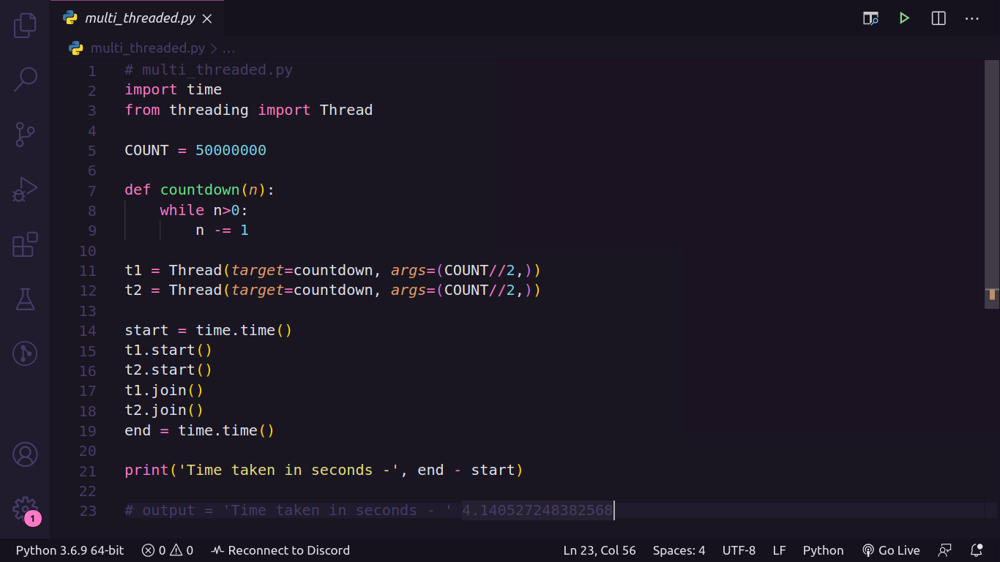
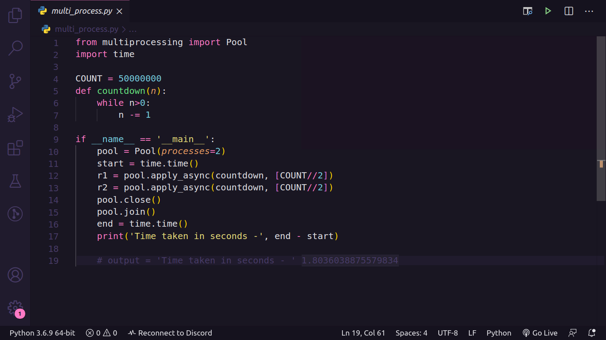

<h3 align="center">
    

GIL em Python
</h3>

<p align="center">
  <a href="#gil?">O que é GIL</a> | 
	<a href="#usabilidade">Para que é usado</a> |  
  <a href="#impacto">Impacto nos programas</a> 
</p>

<h2 id="giç?">O que é GIL?</h2>
GIL é o acronimo para _Global Interpreter Lock_.

O Python _Global Interpreter Lock_, ou simplesmente GIL, é um mutex (ou _lock_) que permite que apenas uma _thread_ tome conta do interpretador Python.
Isso significa que somente uma _thread_ pode estar em um estado de execução em qualquer ponto do tempo.

___

<h2 id="usabilidade">Para que é usado? </h2> 
Quando é declarado uma variavel em Python, ex: `x = 10`, este não aloca um local de memória onde 10 está armazenado, e sim cria um objeto na memória _heap_ onde x conterá uma referência para o objeto 10.

No caso de x posteriormente receber None, ex: `x = None`, Python irá verificar que o numero de referências ao objeto, que no caso por agora não conter uma referencia para o mesmo, terá 0 referências, e será setado como _"Dead Object"_ pelo algoritmo _"Garbage Collector"_, (Coletor de lixo).

> O algoritmo utilizado pelo Garbage Collector do Python é chamado de Reference Counting.
> Você pode obter o numero de contagem de algum argumento atravês do seguinte comando ```sys.getrefcount(<arg>)```

O problema é que essa forma de gerenciamento de memória utilizando reference couting precisa de proteção para um fenômeno chamado _'race conditions'_, onde duas _threads_ aumentam ou diminuem seu valor simultaneamente. Pois se isso acontecer, poderá causar problemas de memória, onde poderá nunca excluir um objeto ou até liberação incorreta do mesmo enquanto ainda existe referência, causando _Bugs_. 

Devido a isso é usado o GIL, aplicando a regra de execução de qualquer código Python a _single lock_ previnindo qualquer _Deadlock_ [^1], que por outro lado transforma qualquer código Python em _single-thread_.

[^1]: _Deadlok_ pode ser traduzido informalmente para Impasse, onde no cenario da Ciência da Computação é usado quando dois ou mais processos ficam impedidos de continuar suas execuções devido um bloqueiar o outro. 

___

<h2 id="impacto">Impacto nos programas</h2>

* Exemplo 1 [single_thread](single_thread.py):
<h3 align="center">

</h3>

```
$ python single_thread.py
Time taken in seconds -  3.3819386959075928
```
* Exemplo 2 [multi_threaded](multi_threaded.py):
2 threads em paralelo
<h3 align="center">

</h3>

```
$ python multi_threaded.py
Time taken in seconds - 4.140527248382568
```


  Como foi notado, ambas as versões levam quase a mesma quantidade de tempo para serem concluídas. Na versão _multithread_ custou ainda mais tempo do que na versão _single_, pois o GIL impediu que os _threads_ ligados à CPU fossem executados em paralelo, devido a estrutura de como é feita a interpretação de códigos em Python, exemplificado abaixo.

<h3 align="center">

</h3>

Referente a figura acima podemos notar que _multiprocessing_ está acima do GIL, na qual você usa vários processos em vez de _threads_. Onde cada processo Python obtém seu próprio interpretador Python e espaço na memória. O Python possui um módulo denominado de _multiprocessing_, que nos permite criar processos facilmente como este :

* Exemplo 3 [multiprocessing](multiprocessing.py):
<h3 align="center">

</h3>

```
$ python multiprocessing.py
Time taken in seconds - 1.8036038875579834
```
Tivemos uma melhora na performance incrível!!

Que fique claro que multi-processing são mais 'pesados' que multi-threading.
Ou seja, lembre-se que para cada processo, teremos um ambiente Python próprio e isso pode se tornar um gargalo de memoria.
___

## :memo: Licença

Esse projeto está sob a licença MIT. Veja o arquivo [LICENSE](https://github.com/wrtinho/GIL-Python/blob/master/LICENSE) para mais detalhes.

---

<h4 align="center">
    Feito com 💜 by <a href="https://www.linkedin.com/in/wellington-rodrigues-a11b1392/" target="_blank">Wellington </a>
</h4>
